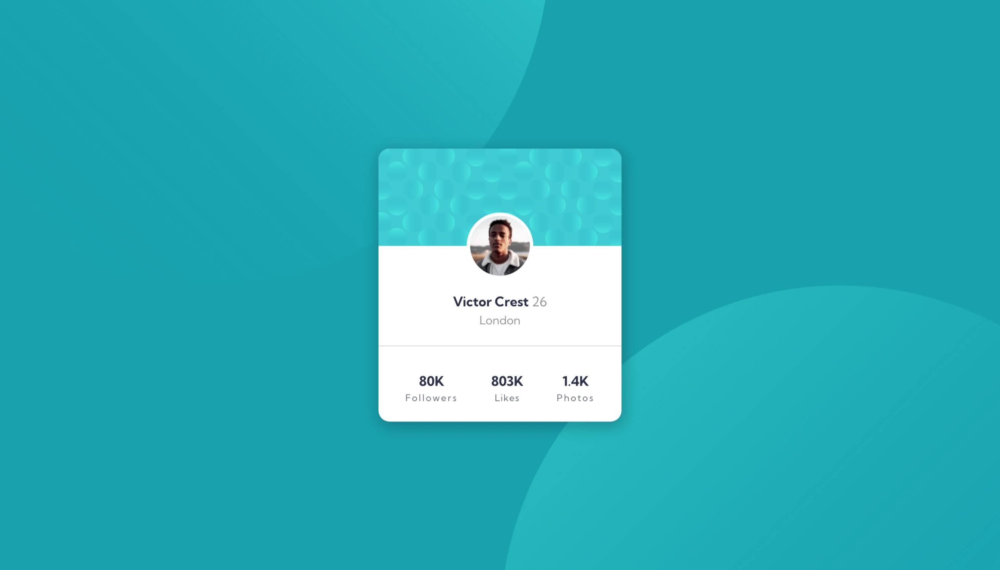
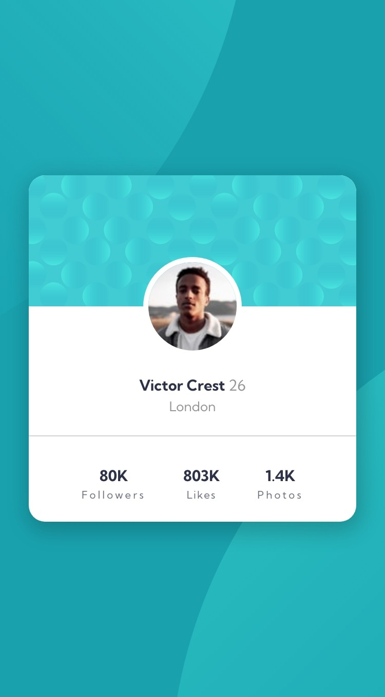

# Frontend Mentor - Profile card component solution

This is a solution to the [Profile card component challenge on Frontend Mentor](https://www.frontendmentor.io/challenges/profile-card-component-cfArpWshJ). Frontend Mentor challenges help you improve your coding skills by building realistic projects.

## Table of contents

- [Overview](#overview)
  - [The challenge](#the-challenge)
  - [Screenshot](#screenshot)
  - [Links](#links)
- [My process](#my-process)
  - [Built with](#built-with)
  - [What I learned](#what-i-learned)
  - [Continued development](#continued-development)
  - [Useful resources](#useful-resources)
- [Author](#author)

## Overview

### The challenge

- This project was built out to the designs that were provided.

### Screenshot



_A desktop view of the profile card_



_A mobile view of the profile card_

### Links

- Solution URL: [Add solution URL here](https://github.com/stephenikuomola/Profile-card)
- Live Site URL: [Add live site URL here](https://stephenikuomola.github.io/Profile-card/)

## My process

### Built with

- Semantic HTML5 markup
- CSS custom properties
- Flexbox
- Mobile-first workflow

### What I learned

This project really helped me in my understanding of how to use the background-position property to position a background image to your preferred position. I was able to understand how you can properly position and image along the x and y-axis at a certain distance.

I have provided a small snippet of how I was able to achieve that below;

```css
.section {
  background-color: var(--dark-cyan);
  display: flex;
  justify-content: center;
  align-items: center;
  min-height: 100vh;
  position: relative;
  background-image: url(../images/bg-pattern-top.svg),
    url(../images/bg-pattern-bottom.svg);
  background-repeat: no-repeat, no-repeat;
  background-position: right 35vw bottom 45vh, left 44vw top 40vh;
}
```

### Continued development

I want to keep carrying out more projects to get better at CSS and how to implement more CSS properties and writing better code.

### Useful resources

- [Mr. Coder ](https://www.youtube.com/watch?v=NZpG9EBKYWc) - This youtube channel really was a life saver when I need to know how I could position the background-images and this was where I was able to get the trick.

## Author

- Twitter - [@\_salutDami](https://www.twitter.com/stephenikuomola)
- Linkedin- [Ikuomola Stephen](https://www.linkedin.com/in/ikuomola-stephen/)
- Frontend Mentor - [@salutDami](https://www.frontendmentor.io/profile/stephenikuomola)
